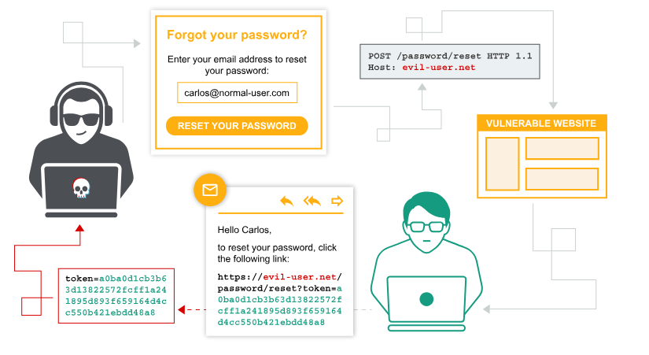

# Authentication Vulnerabilities

Conceptually, authentication vulnerabilities are easy to understand. However, they are usually critical because of the clear relationship between authentication and security.

Authentication vulnerabilities can allow attackers to gain access to sensitive data and functionality. They also expose additional attack surface for further exploits. For this reason, it's important to learn how to identify and exploit authentication vulnerabilities, and how to bypass common protection measures.

In this section, we explain:
- THe most common authentication mechanisms used by websites
- Potential vulnerabilities in these mechanisms.
- Inherent vulnerabilities in different authentication mechanisms
- Typical vulnerabilities that are introduced by their improper implementation
- How you can make your own authentication mechanism as robust as possible

## Brute Force Attacks

A brute force attack is when an attacker uses a system of trial and error to guess valid user credentials. These attacks are typically automated using wordlists of usernames and passwords. Automating this process, especially using dedicated tools, potentially enables an attacke to make vast numbers of login attempts at high speed.

Brute-forcing is not always just a case of making completely random guesses at usernames and passwords. By also using basic logic or publicly available knowledge, attackers can fine-tune brute-force attakcs to make much more educated guesses. This considerably increases the efficiency of such attacks. Websites that rely on password-based login as their sole method of authentication users can be highly vulnerable if they do not implement sufficient brute-forse protection.

### Brute-forcing usernames

Usernames are especially easy to guess if they conform to a recognizable pattern, such as an email address to see business logins in the format `firstname.lastname@somecompany.com`.
However, even if there is no obvious pattern, sometimes even high-priviledged accounts are created using predictable usernames, such as `admin` or `administrator`.

During auditing, check whether the website discloses potential usernames publicly. For example, are you able to access user profiles without logging in? Even if the actual content of the profiles is hidden, the name used in the profile is sometimes the same as the login username. You should also check HTTP responses to see if any email addresses are disclosed. Occasioanlly, responses contain email addresses of high-priviledged users, such as administrators or IT support.

## Username enumeration

Username enumeration is when an attacker is able to observe changes in the website's behavior in order to identify whether a given username is valid.
Username enumeration typically occurs either on the login page, for example, when you enter a valid username but an incorrect password, or on registration forms when you enter a username that is already taken.This greatly reduced the time and effort required to brute-force a login because the attacked is able to quickly generate a shortlist of valid usernames.