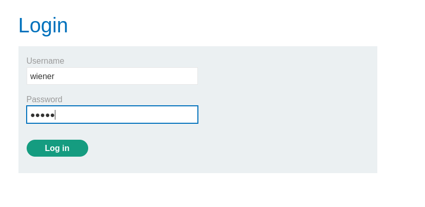
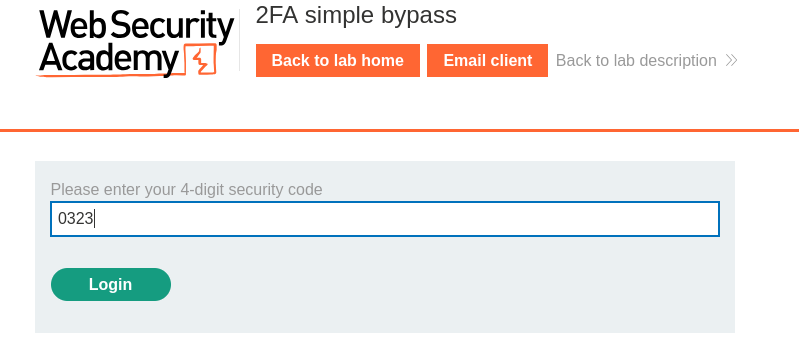
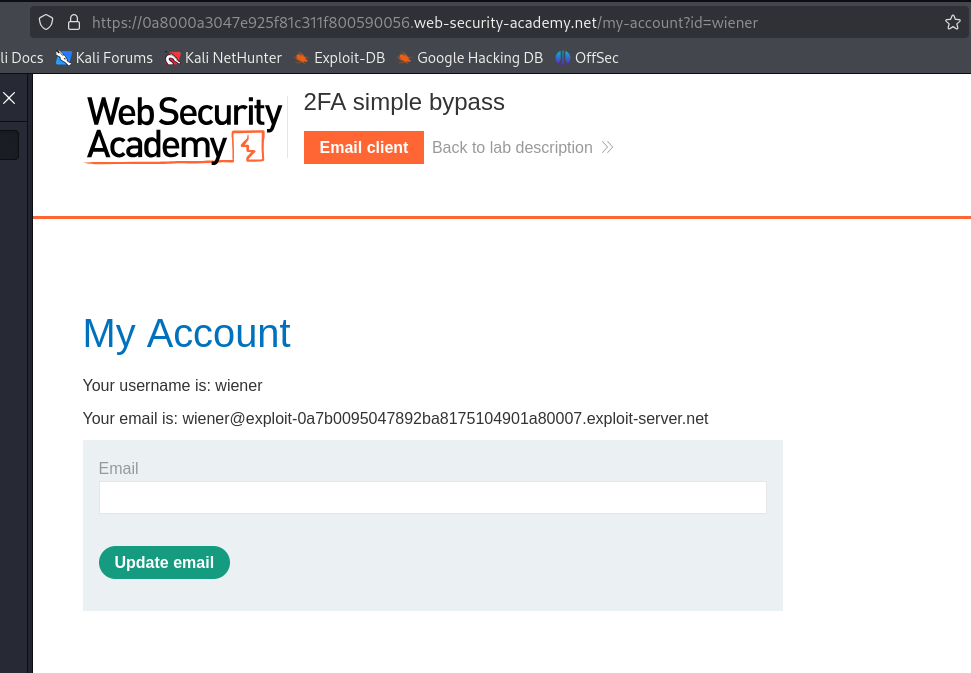
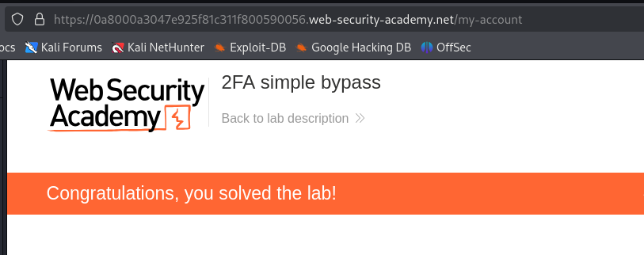

# Lab: 2FA simple bypass

## Description

This lab's two-factor authentication can be bypassed. You have already obtained a valid username and password, but do not have access to the user's 2FA verification code. To solve the lab, access Carlos's account page.

- Your credentials: wiener:peter
- Victim's credentials carlos:montoya

## Solution

This lab demonstrates a scenario where two-factor authentication (2FA) is not properly enforced. Specifically, the application allows access to certain pages without validating the verification code sent to the user's email. The authentication process is completed before the code verification step, allowing unauthorized access to other parts of the application.

To solve this lab, I proceeded with the full login process using an account for which I already had valid credentials and access to the associated email. By leveraging this, I obtained the page name `/my-account` which appears righ after the loggin.

In the next step, I replicated the entire login process using the victim’s credentials. However, since I did not have access to the victim’s email, I exploited the behavior of the application’s URL structure. By appending the my-account page to the end of the URL, I was able to bypass the 2FA verification. This worked because the application was performing the 2FA check only after the user had already been authenticated and authorized, allowing me to access the page without requiring the verification code.

