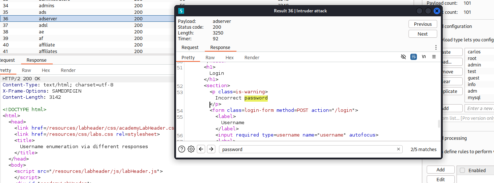
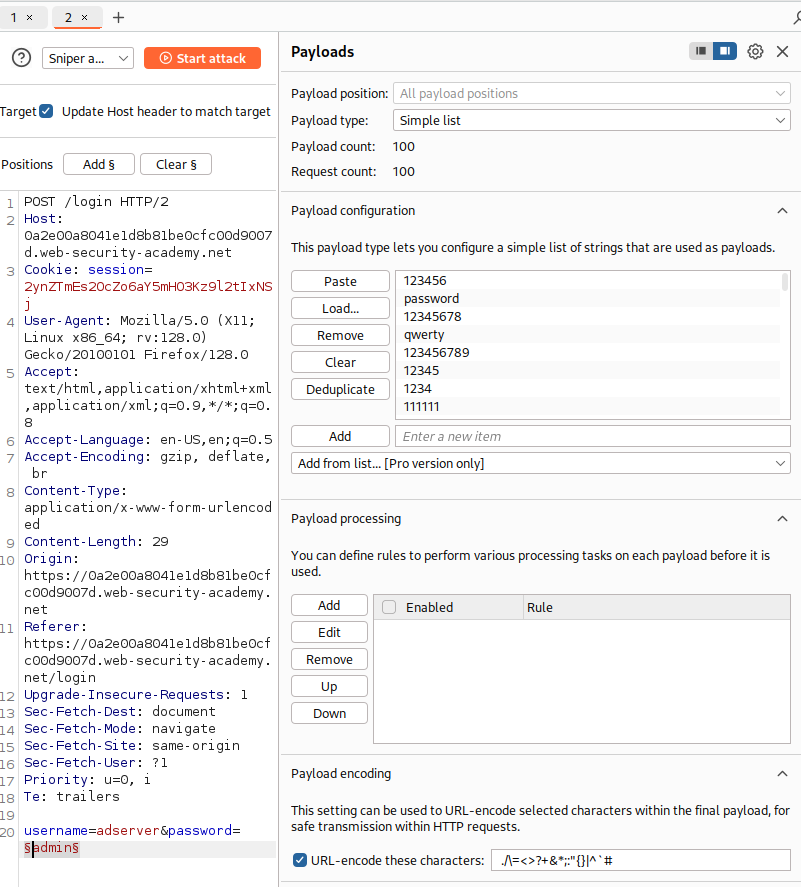
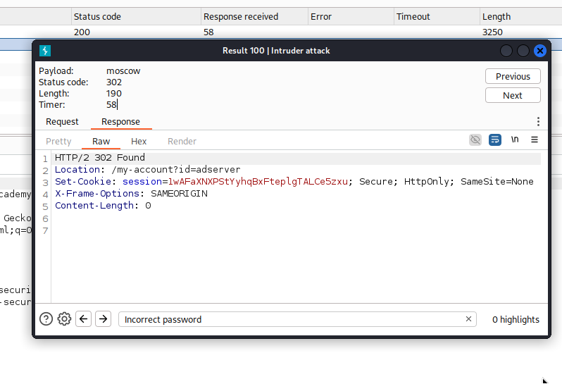

# Lab: Username enumeration via different responses

## Lab Description

This lab is available in Portswigger web page: 
https://portswigger.net/web-security/learning-paths/server-side-vulnerabilities-apprentice/authentication-apprentice/authentication/password-based/lab-username-enumeration-via-different-responses

This lab is vulnerable to username enumeration and password brute-force attacks. It has an account with predictable username and password. which can be found in the following wordlists:
- https://portswigger.net/web-security/authentication/auth-lab-usernames
- https://portswigger.net/web-security/authentication/auth-lab-passwords

To solve the lab, enumerate a valid username, brute-force this user's password, then access their account page.

## Solution

Since this lab focuses on username enumeration, I began by analyzing the login functionality. I inspected the login page and captured the POST request sent to the server, which includes both the Username and Password, and set it to the Intruder.

Next, I replaced the static username in the POST request with a variable and used the username list provided by Burp Suite for testing. By iterating through each username, I analyzed the responses to identify any discrepancies. I observed that when the username `adserver` was submitted, the response contained the message `Incorrect Password` instead of `Incorrect Username`, indicating that adserver is a valid username.

The next step involved testing the passwords using the list provided by Burp Suite. In the POST request, I included the valid adserver username obtained from the previous step and iterated through the password list.

I observed that every unsuccessful login attempt returned an HTML response containing the message `Incorrect password`. 

Therefore, the only correct password would be the one that does not include this message in the response.

As a result, the valid username and password combination was determined to be `adserver`and `moscow`.