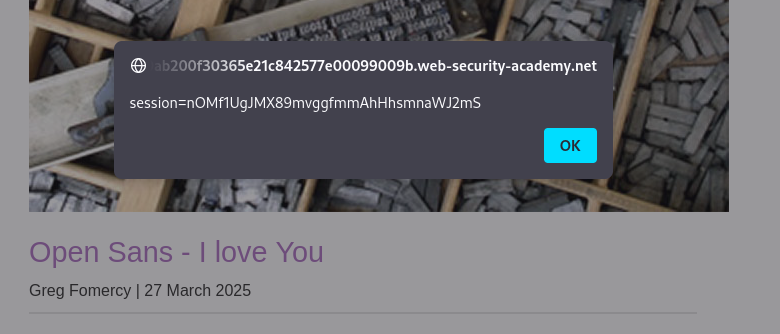

# Lab: Exploiting XSS to steal cookies

This lab is available in Portswigger web page: 
https://portswigger.net/web-security/cross-site-scripting/exploiting/lab-stealing-cookies


## Description 

This lab contains a stored XSS vulnerability in the blog comments function. A simulated victim user views all comments after they are posted. To solve the lab, exploit the vulnerability to exfiltrate the victim's session cookie, then use this cookie to impersonate the victim. 


## Notes

Let's take advantage of this XSS vulnerability to capture user session cookies.

Unfortunately, this specific lab requires the Burp 

Collaborator tool to resolve, a feature exclusive to the professional version of Burp Suite.

Without access to Burp Professional, the attack becomes more intricate. Our first step is to initiate an XSS attack, which will facilitate a Cross-Site Request Forgery (CSRF). This allows us to use the stolen cookie for a session hijacking attack.

### General XSS attack procedure

XSS means that arbitrary js is being execute in the victims browser, usually people do a proof of concepts of an XSS attack simple by popping up an alert function, but what a real XSS attack is going for example to create sometype of HTTP request.

This HTTP request can be created perhaps using javascript fetch, so the users browser is maniputated to sent an HTTP request to the attacker endpoint and send sensitive information like for example the session cookie. And now all the attacker as to do is to check the HTTP requests comming into the endpoint, they can grab users cookie and use that cookie to hijack the victims session.

### Burp Suite Collaborator

<b>What is Burp Collaborator</b>, you ask? Burp Collaborator is an endpoint designed to prevent manipulation of the lab environment by blocking requests to external sites. Without it, vulnerabilities within the lab could potentially be exploited to target external sites.

Without utilizing Burp Collaborator, the approach to solving the lab will be more refined.


### Solution

#### First Stage - XSS Attempt

Upon examining the lab, the first notable observation was the vulnerability of the Comments placeholder on the /post?postId=x page to XSS attacks. By inserting the following script into the comments placeholder, the session cookie is displayed when accessing the post page, thereby confirming my initial assessment

```javascript
<script> alert(document.cookie) </script>
```





To solve this lab we also have to gather the data being used to sent the submit forms HTTP Post request.

```
POST /post/comment HTTP/2
Host: 0ab200f30365e21c842577e00099009b.web-security-academy.net
Cookie: session=nOMf1UgJMX89mvggfmmAhHhsmnaWJ2mS
User-Agent: Mozilla/5.0 (X11; Linux aarch64; rv:102.0) Gecko/20100101 Firefox/102.0
Accept: text/html,application/xhtml+xml,application/xml;q=0.9,image/avif,image/webp,*/*;q=0.8
Accept-Language: en-US,en;q=0.5
Accept-Encoding: gzip, deflate
Content-Type: application/x-www-form-urlencoded
Content-Length: 173
Origin: https://0ab200f30365e21c842577e00099009b.web-security-academy.net
Referer: https://0ab200f30365e21c842577e00099009b.web-security-academy.net/post?postId=9
Upgrade-Insecure-Requests: 1
Sec-Fetch-Dest: document
Sec-Fetch-Mode: navigate
Sec-Fetch-Site: same-origin
Sec-Fetch-User: ?1
Te: trailers

csrf=PoxwHzFo3AWPrgKPvIlFeaKeTSawB8FX&postId=9&comment=%3Cscript%3E+alert%28document.cookie%29+%3C%2Fscript%3E&name=Test&email=test%40gmail.com&website=http%3A%2F%2Ftest.com 
```

In analyzing the request, there are two key elements we can emphasize: the presence of a session cookie and the inclusion of a CSRF token.

A session cookie is used to maintain the user's session state across multiple requests, ensuring that the server recognizes subsequent requests from the same user.

On the other hand, a CSRF (Cross-Site Request Forgery) token plays a crucial role in enhancing the security of web applications. It is a unique, secret, and unpredictable token generated by the server for each session or form submission. 

This token is embedded within forms and requests sent by the user to the server. When a user submits a form or makes a request, the server checks the incoming CSRF token against the one it issued earlier. If they match, it verifies that the request originated from the legitimate user and not from an unauthorized source attempting to execute actions on behalf of the user.

This mechanism helps prevent malicious entities from performing actions without the user's consent by ensuring that requests are authentic and originate from the intended source. This is particularly important in safeguarding user data and maintaining the integrity of web applications.

#### Session cookie hijacking

As previously mentioned, if we had access to Burp Collaborator, we could attempt to send a fetch request using the victim's session cookie directly to the Collaborator endpoint for analysis. However, since this option is unavailable, we will instead employ a JavaScript solution designed to manipulate the victim into posting their session cookie as a blog comment. 

This approach poses a significant security risk, as it would expose the victim's session cookie to any other users viewing the page, potentially allowing unauthorized access to the victim's session and compromising their account security.

After playing a bit with the JS console, this is the way to obtain the csrf token from the forms in the page  