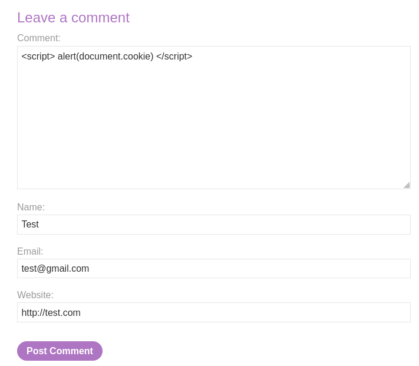

# Lab: Exploiting XSS to steal cookies

This lab is available in Portswigger web page: 
https://portswigger.net/web-security/cross-site-scripting/exploiting/lab-stealing-cookies


## Description 

This lab contains a stored XSS vulnerability in the blog comments function. A simulated victim user views all comments after they are posted. To solve the lab, exploit the vulnerability to exfiltrate the victim's session cookie, then use this cookie to impersonate the victim. 


## Notes

Let's take advantage of this XSS vulnerability to capture user session cookies.

Unfortunately, this specific lab requires the Burp 

Collaborator tool to resolve, a feature exclusive to the professional version of Burp Suite.

Without access to Burp Professional, the attack becomes more intricate. Our first step is to initiate an XSS attack, which will facilitate a Cross-Site Request Forgery (CSRF). This allows us to use the stolen cookie for a session hijacking attack.

### General XSS attack procedure

XSS means that arbitrary js is being execute in the victims browser, usually people do a proof of concepts of an XSS attack simple by popping up an alert function, but what a real XSS attack is going for example to create sometype of HTTP request.

This HTTP request can be created perhaps using javascript fetch, so the users browser is maniputated to sent an HTTP request to the attacker endpoint and send sensitive information like for example the session cookie. And now all the attacker as to do is to check the HTTP requests comming into the endpoint, they can grab users cookie and use that cookie to hijack the victims session.

### Burp Suite Collaborator

<b>What is Burp Collaborator</b>, you ask? Burp Collaborator is an endpoint designed to prevent manipulation of the lab environment by blocking requests to external sites. Without it, vulnerabilities within the lab could potentially be exploited to target external sites.

Without utilizing Burp Collaborator, the approach to solving the lab will be more refined.


### Solution

Upon examining the lab, the first notable observation was the vulnerability of the Comments placeholder on the /post?postId=x page to XSS attacks. By inserting the following script into the comments placeholder, the session cookie is displayed when accessing the post page, thereby confirming my initial assessment

```javascript
<script> alert(document.cookie) </script>
```




