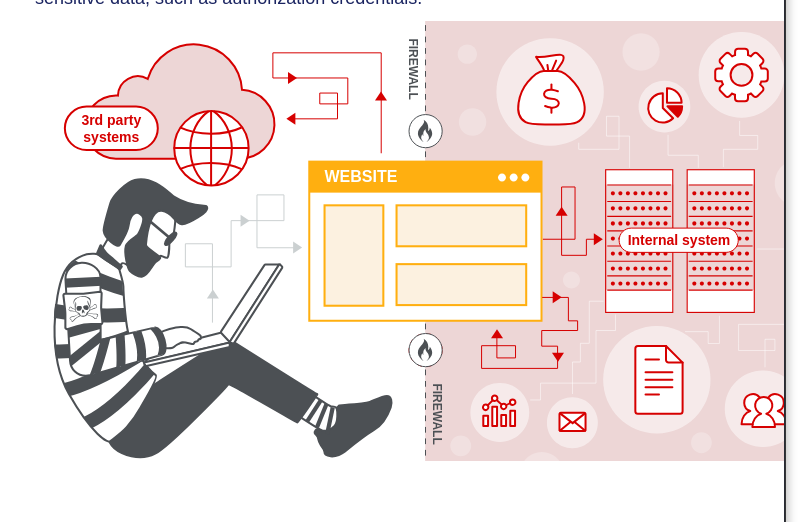

# Server Side Request Forgery

## What is SSRF?

Server-side request forgery is a web security vulnerability that allows an attacker to cause the server-side application to make requests to an unintended location.

In a typical SSRF attack, the attacker might cause the server to make a connection to internal-only services the organization's infrastructure. In other cases, they may be able to force the server to connect to arbitrary external systems. This could leak sensitive data, such as authorization credentials.

## SSRF attacks against the server

In a SSRF attack against the server, the attacker causes the application to make an HTTP request back to the server that is hosting the application, via its loopback network interface. This typically involves supplying a URL with a hostname via 127.0.0.1 (a reserved IP address that point to the loopback adapter) or localhost (a commonly used name for the same adapter).

For example, imagine a shopping application that lets the user view whether an item is in stock in a particular store. To provide the stock information, the application must query various back-end REST APIs. It does this by passing the URL to the relevant back-end API endpoint via a front-end HTTP request. When a user views the stock status for an item, their browser makes the following request:

`
POST /product/stock HTTP/1.0
Content-Type: application/x-www-form-urlencoded
Content-Length: 118

stockApi=http://stock.weliketoshop.net:8080/product/stock/check%3FproductId%3D6%26storeId%3D1
`

This causes the server to make a request tho the specified URL, retrieve the status, and return this to the user.
In this example, an attacker can modify the request to specify a URL local to the server:

`
POST /product/stock HTTP/1.0
Content-Type: application/x-www-form-urlencoded
Content-Length: 118

stockApi=http://localhost/admin
`

The server fetches the contents of the `/admin` URL and returns it to the user.
An attacker can visit the `/admin` URL, but the admnistrative functionality is normally only accessible to authenticated users. This means an attacker won't see anything of interest. However, if the request to the `admin` URL comes from the local machine, the normal access controls are bypassed. The application grants full acces to the administrative functionality, because the request appears to originate from a trusted location.
